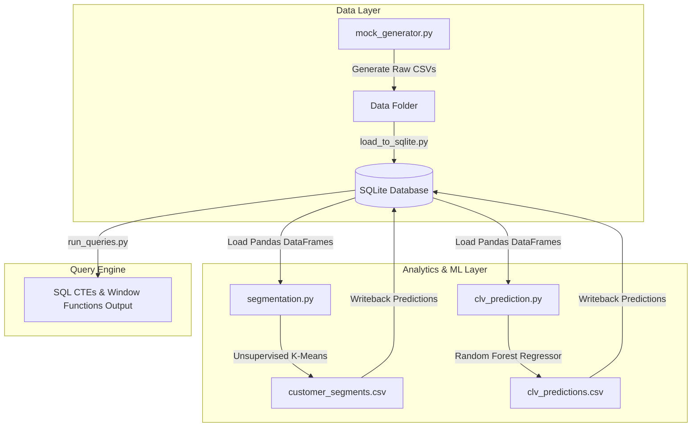

# End-to-End E-Commerce Customer Analytics & Value Prediction

A production-grade backend and analytics engineering project. This repository features a simulated transaction database, a machine learning pipeline for customer segmentation and lifetime value (CLV) forecasting, and an SQL query engine using advanced analytical functions.

---

## 🚀 System Architecture



---

## 🛠️ Tech Stack & Skills Showcased

*   **Database & SQL**: SQLite / MySQL, Common Table Expressions (CTEs), Window Functions (`LAG`, `DENSE_RANK`), Indexing, Database Schema Design.
*   **Programming & ETL**: Python, Pandas, NumPy, Scikit-Learn, SciPy.
*   **Machine Learning & Statistics**: Unsupervised Learning (K-Means Clustering), Supervised Learning (Random Forest Regression), Feature Engineering, Model Evaluation, A/B Testing, Hypothesis Testing (Chi-Square & T-Test).

---

## 📊 Project Steps & Directory Structure

```text
├── README.md                 # Project architecture & highlights
├── data/
│   ├── mock_generator.py     # Simulates transactions, customers, & discount codes
│   ├── customer_segments.csv # Generated K-Means segments
│   ├── clv_predictions.csv   # Generated Random Forest predictions
│   └── ab_test_data.csv      # Generated A/B testing simulation logs
├── sql/
│   ├── schema.sql            # Database schema design
│   └── analytics_queries.sql # Raw SQL queries for window functions & CTEs
└── python/
    ├── eda.py                # Exploratory Data Analysis & initial metrics
    ├── segmentation.py       # Customer segmentation ML model
    ├── clv_prediction.py     # Customer Lifetime Value forecasting model
    ├── ab_testing.py         # A/B Testing and Hypothesis Testing (SciPy)
    ├── load_to_sqlite.py     # Pushes clean CSV data to SQLite DB
    └── run_queries.py        # Connects to SQLite & executes SQL analytics
```

---

## 💡 Machine Learning Highlights

### 1. Customer Segmentation (K-Means Clustering)
Customers are grouped into 4 distinct segments using their **Recency, Frequency, and Monetary (RFM)** behavior:
*   **Champions / VIPs**: High frequency, high spenders who bought recently.
*   **Loyal / Regular**: Consistent purchase intervals and average spend.
*   **Active - Low Spend**: Frequently active but make small purchases.
*   **At Risk / Churned**: Haven't ordered in a long time; high risk of leaving.

### 2. Customer Lifetime Value Prediction (Random Forest)
*   **Approach**: Uses a time-window split where 2025 purchase behavior predicts 2026 spend.
*   **Evaluation Metric**: Evaluated using **R-squared ($R^2$)** and **Root Mean Squared Error (RMSE)** to measure forecast accuracy.

---

## 🔍 SQL Query Highlights (CTEs & Window Functions)

The analytics engine uses complex SQL queries. Examples can be run directly using `run_queries.py`:

*   **Month-over-Month (MoM) Growth** (Uses `LAG` to compare net revenue month-over-month).
*   **Top 3 Best-Selling Products** (Uses `DENSE_RANK() OVER (PARTITION BY Category)`).
*   **Average Days Between Orders** (Calculates julian date differences partitioned by customer using `LAG`).

---

## ⚙️ Installation & Running Guide

### 1. Install Python Dependencies
```bash
pip install pandas scikit-learn scipy
```

### 2. Generate the Dataset
Create the mock e-commerce transactional database:
```bash
python python/mock_generator.py
```

### 3. Run Exploratory Data Analysis
```bash
python python/eda.py
```

### 4. Run Machine Learning Models
Generate customer segmentation clusters and CLV regression predictions:
```bash
python python/segmentation.py
python python/clv_prediction.py
```

### 5. Run A/B Testing & Statistical Analysis
Analyze a simulated A/B test conversion rate (Chi-Square) and Average Order Value (T-Test):
```bash
python python/ab_testing.py
```

### 6. Setup SQL Database & Run Queries
Pushes the dataset and predictions to the local SQL database, and runs the analytics suite:
```bash
python python/load_to_sqlite.py
python python/run_queries.py
```
